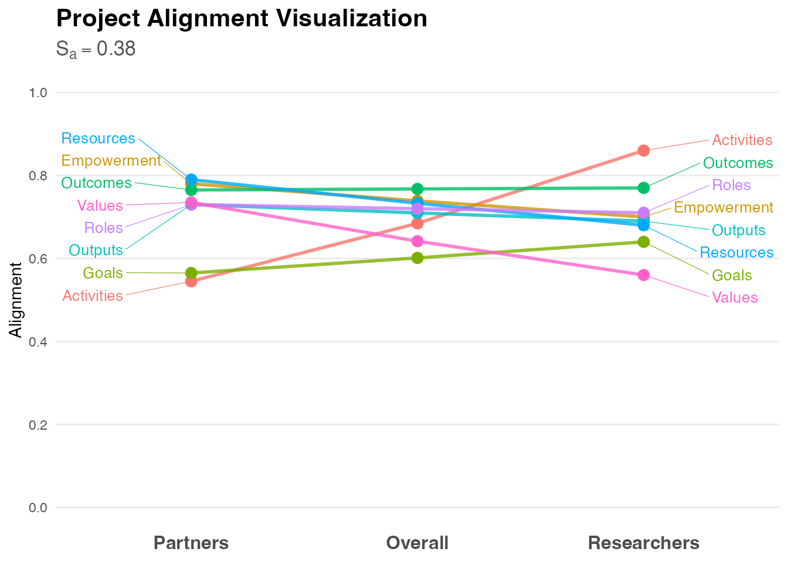
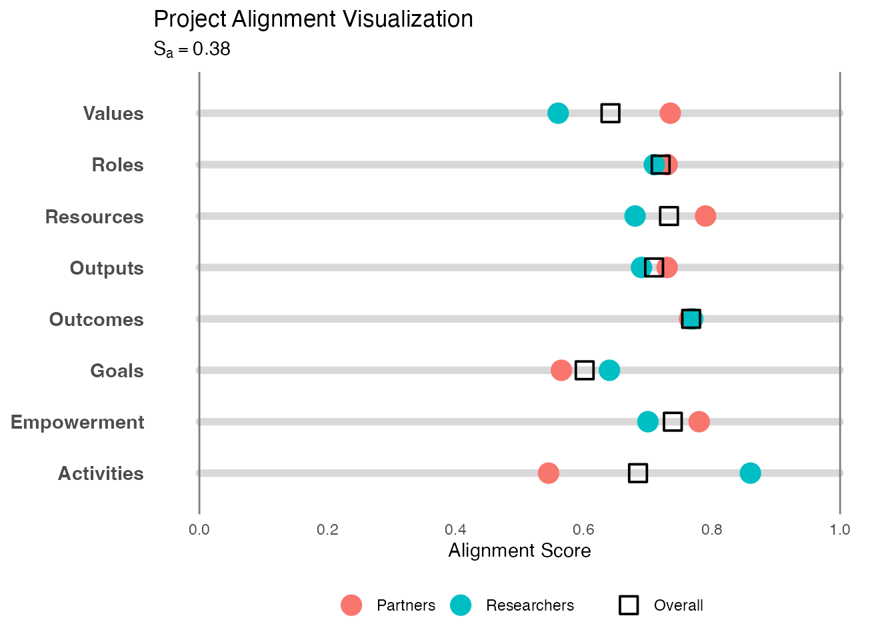
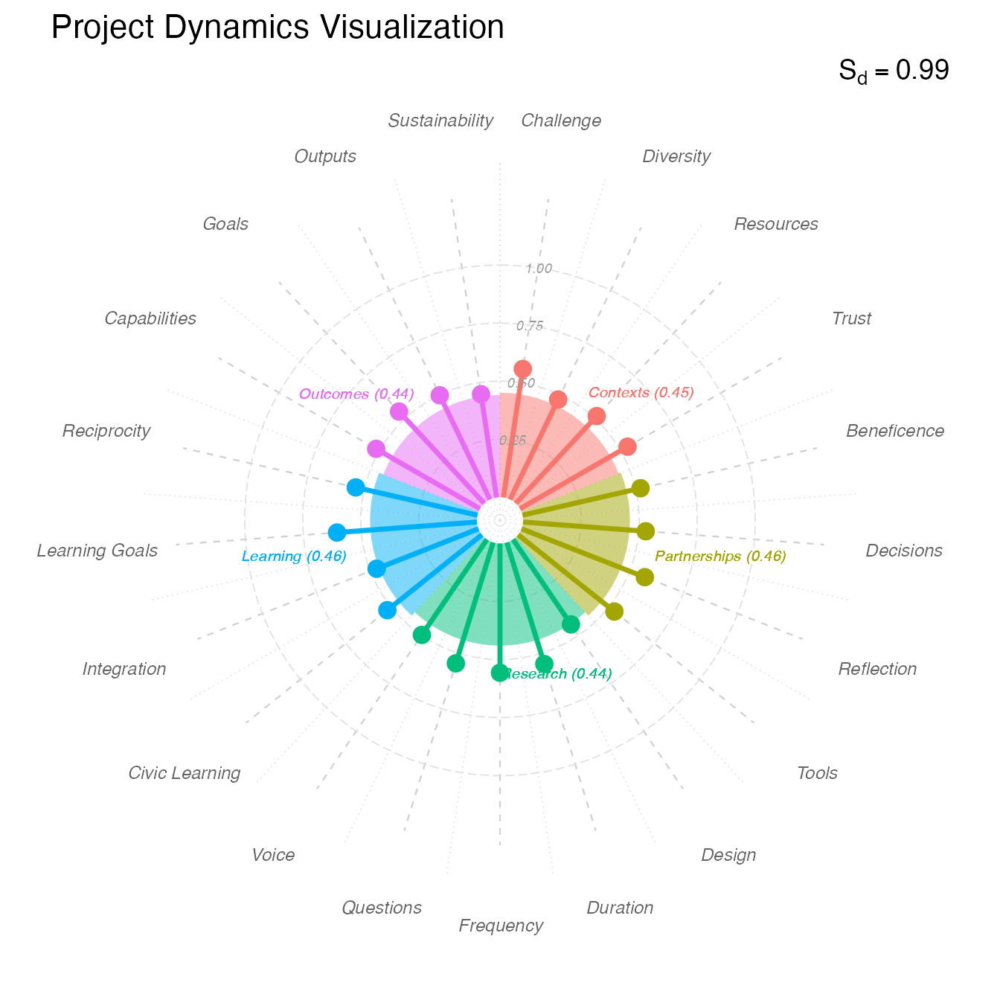
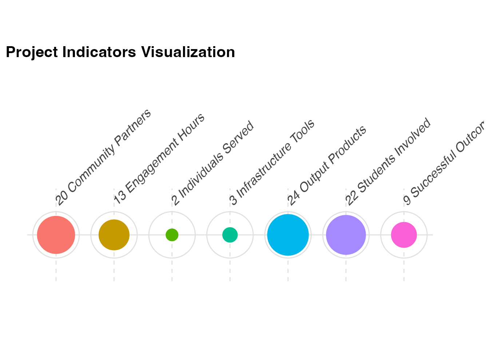
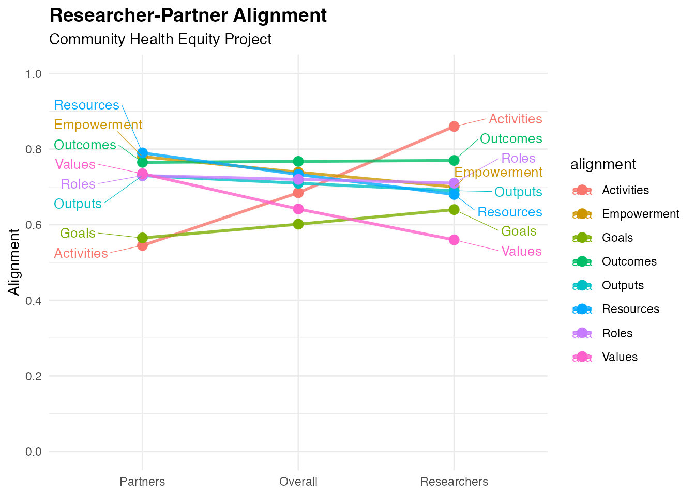
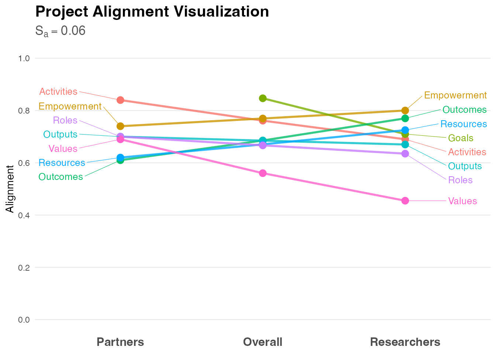

# Getting Started with centrimpact

## Introduction

The `centrimpact` package provides tools for analyzing and visualizing
community-engaged research metrics based on the CEnTR\*IMPACT framework
(Price, 2024). This framework quantifies four critical dimensions of
community-engaged research that go beyond traditional academic metrics:

1.  **Alignment** - Shared vision between researchers and partners
2.  **Cascade Effects** - Ripple effects across social networks
3.  **Dynamics** - Quality of partnership processes
4.  **Indicators** - Traditional academic productivity markers

This vignette demonstrates the basic workflow for analyzing each
dimension and creating publication-ready visualizations.

## Installation

``` r
# Install from GitHub
devtools::install_github("CENTR-IMPACT/centrimpact-review")
```

``` r
library(centrimpact)
```

## Analyzing Project Alignment

The Alignment Score (Sa) quantifies consensus between researchers and
community partners across four key areas: Goals, Values, Roles, and
Resources. Higher scores indicate stronger shared vision.

### Generate and Analyze Data

``` r
# Generate example alignment data
alignment_data <- generate_alignment_data(seed = 36)

# View the structure
head(alignment_data)
#>   alignment       role rating
#> 1     Goals researcher   0.53
#> 2     Goals researcher   0.85
#> 3     Goals researcher   0.37
#> 4     Goals researcher   0.97
#> 5     Goals researcher   0.64
#> 6     Goals    partner   0.42

# Analyze alignment
alignment_results <- analyze_alignment(alignment_data)

# View results
print(alignment_results)
#> $table
#>     alignment partner researcher
#> 1  Activities   0.545       0.86
#> 2 Empowerment   0.780       0.70
#> 3       Goals   0.565       0.64
#> 4    Outcomes   0.765       0.77
#> 5     Outputs   0.730       0.69
#> 6   Resources   0.790       0.68
#> 7       Roles   0.730       0.71
#> 8      Values   0.735       0.56
#> 
#> $plot_data
#>      alignment       role    rating min_val max_val
#> 1   Activities    partner 0.5450000   0.545   0.545
#> 2   Activities researcher 0.8600000   0.860   0.860
#> 3  Empowerment    partner 0.7800000   0.780   0.780
#> 4  Empowerment researcher 0.7000000   0.700   0.700
#> 5        Goals    partner 0.5650000   0.565   0.565
#> 6        Goals researcher 0.6400000   0.640   0.640
#> 7     Outcomes    partner 0.7650000   0.765   0.765
#> 8     Outcomes researcher 0.7700000   0.770   0.770
#> 9      Outputs    partner 0.7300000   0.730   0.730
#> 10     Outputs researcher 0.6900000   0.690   0.690
#> 11   Resources    partner 0.7900000   0.790   0.790
#> 12   Resources researcher 0.6800000   0.680   0.680
#> 13       Roles    partner 0.7300000   0.730   0.730
#> 14       Roles researcher 0.7100000   0.710   0.710
#> 15      Values    partner 0.7350000   0.735   0.735
#> 16      Values researcher 0.5600000   0.560   0.560
#> 17  Activities    overall 0.6846167      NA      NA
#> 18 Empowerment    overall 0.7389181      NA      NA
#> 19       Goals    overall 0.6013319      NA      NA
#> 20    Outcomes    overall 0.7674959      NA      NA
#> 21     Outputs    overall 0.7097183      NA      NA
#> 22   Resources    overall 0.7329393      NA      NA
#> 23       Roles    overall 0.7199306      NA      NA
#> 24      Values    overall 0.6415606      NA      NA
#> 
#> $icc
#>  Single Score Intraclass Correlation
#> 
#>    Model: twoway 
#>    Type : agreement 
#> 
#>    Subjects = 8 
#>      Raters = 2 
#>    ICC(A,1) = -0.383
#> 
#>  F-Test, H0: r0 = 0 ; H1: r0 > 0 
#>   F(7,6.99) = 0.515 , p = 0.799 
#> 
#>  95%-Confidence Interval for ICC Population Values:
#>   -1.05 < ICC < 0.473
#> 
#> $alignment_score
#> [1] 0.3829787
#> 
#> attr(,"class")
#> [1] "alignment_analysis"
```

### Visualize with Slopegraph

The slopegraph shows how researcher and partner ratings compare across
domains:

``` r
# Create slopegraph visualization
plot_slopegraph <- visualize_alignment(alignment_results)
print(plot_slopegraph)
```



### Visualize with Abacus Plot

The abacus plot provides an alternative view of alignment patterns:

``` r
# Create abacus plot
plot_abacus <- visualize_abacus(alignment_results)
print(plot_abacus)
```



## Analyzing Cascade Effects

The Cascade Effects Score (Sc) quantifies how information and power
distribute across three degrees of separation from core participants,
based on social network analysis principles.

### Generate and Analyze Data

``` r
# Generate example cascade data (returns a one-row survey parameter frame)
cascade_data <- generate_cascade_data(seed = 36)

# View the structure
print(cascade_data)
#>   cascade_d1_people_1_1 cascade_d1_people_2_1 cascade_d2_people_1_1
#> 1                     6                     4                     4
#>   cascade_d2_people_2_1 cascade_d2_stats_1 cascade_d2_stats_2 cascade_d3_people
#> 1                     4               0.06               0.29                 2
#>   cascade_d3_stats_1 cascade_d3_stats_2
#> 1               0.04               0.08

# Analyze cascade effects
cascade_results <- analyze_cascade(cascade_data)
#> Running full exact analysis (~356 expected edges).

# View results
print(cascade_results)
#> $summary
#> # A tibble: 3 × 9
#>   layer count gamma layer_knitting layer_bridging layer_channeling
#>   <int> <int> <dbl>          <dbl>          <dbl>            <dbl>
#> 1     1    10  0.9           0.462         0.866             0.768
#> 2     2    40  0.5           0.311         0.671             0.525
#> 3     3    80  0.45          0.304         0.0214            0.117
#> # ℹ 3 more variables: layer_reaching <dbl>, layer_score <dbl>,
#> #   layer_number <chr>
#> 
#> $node_data
#>     name layer gamma  knitting  bridging  channeling     reaching
#> 1      1     1  0.90 0.2310191 0.8914286 0.761128885 8.687130e-01
#> 2      2     1  0.90 0.4410191 0.8914286 0.842286629 8.746834e-01
#> 3      3     1  0.90 0.8610191 0.8914286 0.817723573 8.568997e-01
#> 4      4     1  0.90 0.4410191 0.7714286 0.623909285 8.531427e-01
#> 5      5     1  0.90 0.4410191 0.8914286 0.801594718 8.872156e-01
#> 6      6     1  0.90 0.2310191 1.0000000 1.000000000 1.000000e+00
#> 7      7     1  0.90 0.2310191 0.8914286 0.805660476 8.726926e-01
#> 8      8     1  0.90 0.4410191 0.8914286 0.818248382 9.083834e-01
#> 9      9     1  0.90 0.4410191 0.7714286 0.693940714 8.399535e-01
#> 10    10     1  0.90 0.8610191 0.7714286 0.518150963 8.705867e-01
#> 11    11     2  0.50 0.2476336 0.7714286 0.647774315 2.357223e-01
#> 12    12     2  0.50 0.3456865 0.6285714 0.436476124 6.629096e-02
#> 13    13     2  0.50 0.3058511 0.6285714 0.436476124 6.629096e-02
#> 14    14     2  0.50 0.3959871 0.6285714 0.436476124 1.397907e-01
#> 15    15     2  0.50 0.3931732 0.7714286 0.686983766 2.082751e-01
#> 16    16     2  0.50 0.3006751 0.6285714 0.503779818 6.696343e-02
#> 17    17     2  0.50 0.2570330 0.6285714 0.503779818 6.696343e-02
#> 18    18     2  0.50 0.4005983 0.6285714 0.503779818 6.696343e-02
#> 19    19     2  0.50 0.2613928 0.6285714 0.482505536 6.494104e-02
#> 20    20     2  0.50 0.4600816 0.6285714 0.482505536 6.494104e-02
#> 21    21     2  0.50 0.2310191 0.7714286 0.659675143 9.909114e-02
#> 22    22     2  0.50 0.2910092 0.6285714 0.482505536 1.384408e-01
#> 23    23     2  0.50 0.2752293 0.6285714 0.433499082 1.227962e-01
#> 24    24     2  0.50 0.2722332 0.7714286 0.679989784 2.192931e-01
#> 25    25     2  0.50 0.3678516 0.6285714 0.433499082 9.829632e-02
#> 26    26     2  0.50 0.2832792 0.6285714 0.433499082 4.929651e-02
#> 27    27     2  0.50 0.3310426 0.6285714 0.468701335 6.819949e-02
#> 28    28     2  0.50 0.2909445 0.7714286 0.643832394 2.135120e-01
#> 29    29     2  0.50 0.2722332 0.6285714 0.468701335 6.819949e-02
#> 30    30     2  0.50 0.2440603 0.6285714 0.468701335 6.819949e-02
#> 31    31     2  0.50 0.2837613 0.7714286 0.683679382 2.136962e-01
#> 32    32     2  0.50 0.2310191 0.6285714 0.525892539 9.012599e-02
#> 33    33     2  0.50 0.3192071 0.7714286 0.699558217 2.032272e-01
#> 34    34     2  0.50 0.3482623 0.6285714 0.525892539 1.391258e-01
#> 35    35     2  0.50 0.2310191 0.6285714 0.472492272 6.506078e-02
#> 36    36     2  0.50 0.3707362 0.6285714 0.472492272 6.506078e-02
#> 37    37     2  0.50 0.2486168 0.7714286 0.670800035 2.009685e-01
#> 38    38     2  0.50 0.2740614 0.6285714 0.472492272 1.140606e-01
#> 39    39     2  0.50 0.3289623 0.6285714 0.486892710 1.179417e-01
#> 40    40     2  0.50 0.3107460 0.6285714 0.486892710 6.894189e-02
#> 41    41     2  0.50 0.2775804 0.7714286 0.696971196 2.634384e-01
#> 42    42     2  0.50 0.2810420 0.6285714 0.513714144 8.263349e-02
#> 43    43     2  0.50 0.3081590 0.6285714 0.497918175 4.979089e-02
#> 44    44     2  0.50 0.5810191 0.6285714 0.497918175 6.612416e-02
#> 45    45     2  0.50 0.3401606 0.6285714 0.532764957 1.134621e-01
#> 46    46     2  0.50 0.2722332 0.7714286 0.709770950 1.859441e-01
#> 47    47     2  0.50 0.2551971 0.7714286 0.476873322 1.336329e-01
#> 48    48     2  0.50 0.4402654 0.6285714 0.362452981 8.687832e-02
#> 49    49     2  0.50 0.2381512 0.7714286 0.578073191 2.715398e-01
#> 50    50     2  0.50 0.2697450 0.6285714 0.326726583 6.491119e-02
#> 51    51     3  0.45 0.3381864 0.0000000 0.131129373 1.997112e-02
#> 52    52     3  0.45 0.5352767 0.0000000 0.131129373 7.509591e-02
#> 53    53     3  0.45 0.3294841 0.0000000 0.063899810 3.374881e-03
#> 54    54     3  0.45 0.2310191 0.0000000 0.063899810 3.374881e-03
#> 55    55     3  0.45 0.3768237 0.0000000 0.063899810 2.174981e-02
#> 56    56     3  0.45 0.2594669 0.0000000 0.063899810 3.374881e-03
#> 57    57     3  0.45 0.2456855 0.0000000 0.063899810 3.374881e-03
#> 58    58     3  0.45 0.2636547 0.0000000 0.063899810 3.374881e-03
#> 59    59     3  0.45 0.3619790 0.0000000 0.163670063 2.005613e-02
#> 60    60     3  0.45 0.4626586 0.0000000 0.163670063 5.155601e-02
#> 61    61     3  0.45 0.2840413 0.0000000 0.119837217 3.475457e-03
#> 62    62     3  0.45 0.3689594 0.0000000 0.119837217 2.239746e-01
#> 63    63     3  0.45 0.2508059 0.0000000 0.119837217 3.475457e-03
#> 64    64     3  0.45 0.2351713 0.0000000 0.119837217 3.475457e-03
#> 65    65     3  0.45 0.2883897 0.0000000 0.119837217 3.475457e-03
#> 66    66     3  0.45 0.3463329 0.0000000 0.119837217 3.475457e-03
#> 67    67     3  0.45 0.2310191 0.0000000 0.102277803 3.171421e-03
#> 68    68     3  0.45 0.3094132 0.0000000 0.102277803 3.171421e-03
#> 69    69     3  0.45 0.2689447 0.0000000 0.102277803 3.171421e-03
#> 70    70     3  0.45 0.3089000 0.0000000 0.102277803 3.171421e-03
#> 71    71     3  0.45 0.3221706 0.0000000 0.143719974 5.597495e-02
#> 72    72     3  0.45 0.2330344 0.0000000 0.143719974 1.187512e-02
#> 73    73     3  0.45 0.2805217 0.0000000 0.102277803 3.171421e-03
#> 74    74     3  0.45 0.2829164 0.0000000 0.102277803 3.171421e-03
#> 75    75     3  0.45 0.3751205 0.0000000 0.060882947 1.102496e-01
#> 76    76     3  0.45 0.3198483 0.0000000 0.060882947 0.000000e+00
#> 77    77     3  0.45 0.2851901 0.0000000 0.155036536 2.122241e-02
#> 78    78     3  0.45 0.2696205 0.0000000 0.155036536 2.122241e-02
#> 79    79     3  0.45 0.4376948 0.0000000 0.060882947 4.409983e-02
#> 80    80     3  0.45 0.2720390 0.0000000 0.060882947 0.000000e+00
#> 81    81     3  0.45 0.2310191 0.0000000 0.060882947 0.000000e+00
#> 82    82     3  0.45 0.3070574 0.0000000 0.060882947 0.000000e+00
#> 83    83     3  0.45 0.2975953 0.0000000 0.089854402 3.643575e-03
#> 84    84     3  0.45 0.3437040 0.0000000 0.089854402 6.979332e-02
#> 85    85     3  0.45 0.2405363 0.0000000 0.131242377 2.080677e-02
#> 86    86     3  0.45 0.3626060 0.0000000 0.131242377 2.080677e-02
#> 87    87     3  0.45 0.3420384 0.0000000 0.089854402 3.643575e-03
#> 88    88     3  0.45 0.3759121 0.0000000 0.089854402 3.643575e-03
#> 89    89     3  0.45 0.3685673 0.0000000 0.089854402 4.774341e-02
#> 90    90     3  0.45 0.2428298 0.0000000 0.089854402 3.643575e-03
#> 91    91     3  0.45 0.2649346 0.0000000 0.160670387 2.486598e-02
#> 92    92     3  0.45 0.2623500 0.0000000 0.160670387 2.486598e-02
#> 93    93     3  0.45 0.2679133 0.0000000 0.135126102 7.813157e-03
#> 94    94     3  0.45 0.3046883 0.0000000 0.135126102 7.813157e-03
#> 95    95     3  0.45 0.2855057 0.0000000 0.174915858 1.654167e-02
#> 96    96     3  0.45 0.2310191 0.0000000 0.174915858 1.654167e-02
#> 97    97     3  0.45 0.3208963 0.0000000 0.135126102 7.813157e-03
#> 98    98     3  0.45 0.2590785 0.0000000 0.135126102 7.813157e-03
#> 99    99     3  0.45 0.3377790 0.0000000 0.093742606 3.186992e-03
#> 100  100     3  0.45 0.5460191 0.0000000 0.093742606 3.258688e-02
#> 101  101     3  0.45 0.2643055 0.0000000 0.093742606 3.186992e-03
#> 102  102     3  0.45 0.3114527 0.0000000 0.093742606 3.186992e-03
#> 103  103     3  0.45 0.2767999 0.0000000 0.153964632 1.254068e-02
#> 104  104     3  0.45 0.2310191 0.0000000 0.153964632 1.254068e-02
#> 105  105     3  0.45 0.2463240 0.0000000 0.093742606 3.186992e-03
#> 106  106     3  0.45 0.3511262 0.0000000 0.093742606 3.186992e-03
#> 107  107     3  0.45 0.2850611 0.0000000 0.106196421 3.753944e-03
#> 108  108     3  0.45 0.2634972 0.0000000 0.106196421 3.753944e-03
#> 109  109     3  0.45 0.3252998 0.0000000 0.106196421 3.753944e-03
#> 110  110     3  0.45 0.3200912 0.0000000 0.106196421 6.990369e-02
#> 111  111     3  0.45 0.3311492 0.0000000 0.172816865 2.497635e-02
#> 112  112     3  0.45 0.2432690 0.0000000 0.172816865 2.497635e-02
#> 113  113     3  0.45 0.4420753 0.4285714 0.357393635 4.619592e-02
#> 114  114     3  0.45 0.3265094 0.0000000 0.140590359 6.627147e-03
#> 115  115     3  0.45 0.2868704 0.0000000 0.118513655 8.037924e-05
#> 116  116     3  0.45 0.2496596 0.0000000 0.118513655 8.037924e-05
#> 117  117     3  0.45 0.2944472 0.0000000 0.118513655 8.037924e-05
#> 118  118     3  0.45 0.3049567 0.0000000 0.118513655 8.037924e-05
#> 119  119     3  0.45 0.4012790 0.4285714 0.386875194 1.355279e-01
#> 120  120     3  0.45 0.2876536 0.0000000 0.159022532 3.092891e-03
#> 121  121     3  0.45 0.2764653 0.4285714 0.397474387 6.008921e-02
#> 122  122     3  0.45 0.3105502 0.0000000 0.194629420 1.985487e-02
#> 123  123     3  0.45 0.3138596 0.0000000 0.006477468 8.969169e-03
#> 124  124     3  0.45 0.2860127 0.0000000 0.006477468 8.969169e-03
#> 125  125     3  0.45 0.2865619 0.0000000 0.010122479 4.722804e-04
#> 126  126     3  0.45 0.2310191 0.0000000 0.010122479 4.722804e-04
#> 127  127     3  0.45 0.3048490 0.0000000 0.080393449 1.725641e-02
#> 128  128     3  0.45 0.2400665 0.0000000 0.080393449 1.725641e-02
#> 129  129     3  0.45 0.2474648 0.4285714 0.142613763 3.990934e-02
#> 130  130     3  0.45 0.2310191 0.0000000 0.000000000 3.246517e-03
#>     composite_score
#> 1        0.68807239
#> 2        0.76235442
#> 3        0.85676773
#> 4        0.67237492
#> 5        0.75531450
#> 6        0.80775477
#> 7        0.70020019
#> 8        0.76476985
#> 9        0.68658547
#> 10       0.75529632
#> 11       0.47563969
#> 12       0.36925626
#> 13       0.35929740
#> 14       0.40020633
#> 15       0.51496517
#> 16       0.37499745
#> 17       0.36408692
#> 18       0.39997824
#> 19       0.35935270
#> 20       0.40902491
#> 21       0.44030349
#> 22       0.38513173
#> 23       0.36502400
#> 24       0.48573617
#> 25       0.38205461
#> 26       0.34866156
#> 27       0.37412871
#> 28       0.47992937
#> 29       0.35942637
#> 30       0.35238315
#> 31       0.48814135
#> 32       0.36890226
#> 33       0.49835526
#> 34       0.41046301
#> 35       0.34928589
#> 36       0.38421516
#> 37       0.47295347
#> 38       0.37229642
#> 39       0.39059203
#> 40       0.37378802
#> 41       0.50235463
#> 42       0.37649027
#> 43       0.37110987
#> 44       0.44340821
#> 45       0.40373976
#> 46       0.48484421
#> 47       0.40928297
#> 48       0.37954203
#> 49       0.46479818
#> 50       0.32248855
#> 51       0.12232173
#> 52       0.18537549
#> 53       0.09918970
#> 54       0.07457345
#> 55       0.11561833
#> 56       0.08168540
#> 57       0.07824004
#> 58       0.08273236
#> 59       0.13642630
#> 60       0.16947117
#> 61       0.10183849
#> 62       0.17819281
#> 63       0.09352965
#> 64       0.08962099
#> 65       0.10292560
#> 66       0.11741140
#> 67       0.08411708
#> 68       0.10371562
#> 69       0.09359848
#> 70       0.10358730
#> 71       0.13046639
#> 72       0.09715738
#> 73       0.09649274
#> 74       0.09709140
#> 75       0.13656325
#> 76       0.09518282
#> 77       0.11536226
#> 78       0.11146985
#> 79       0.13566941
#> 80       0.08323049
#> 81       0.07297551
#> 82       0.09198509
#> 83       0.09777331
#> 84       0.12583793
#> 85       0.09814636
#> 86       0.12866379
#> 87       0.10888410
#> 88       0.11735252
#> 89       0.12654127
#> 90       0.08408196
#> 91       0.11261774
#> 92       0.11197158
#> 93       0.10271313
#> 94       0.11190690
#> 95       0.11924082
#> 96       0.10561915
#> 97       0.11595888
#> 98       0.10050444
#> 99       0.10867716
#> 100      0.16808714
#> 101      0.09030878
#> 102      0.10209557
#> 103      0.11082631
#> 104      0.09938110
#> 105      0.08581339
#> 106      0.11201396
#> 107      0.09875286
#> 108      0.09336190
#> 109      0.10881253
#> 110      0.12404783
#> 111      0.13223560
#> 112      0.11026555
#> 113      0.31855906
#> 114      0.11843173
#> 115      0.10136610
#> 116      0.09206342
#> 117      0.10326031
#> 118      0.10588769
#> 119      0.33806339
#> 120      0.11244226
#> 121      0.29065007
#> 122      0.13125861
#> 123      0.08232656
#> 124      0.07536484
#> 125      0.07428917
#> 126      0.06040346
#> 127      0.10062472
#> 128      0.08442909
#> 129      0.21463983
#> 130      0.05856640
#> 
#> $cascade_score
#> [1] 0.6689556
#> 
#> $topology_score
#> [1] 0.2310191
#> 
#> $mode
#> [1] "full"
#> 
#> $estimated_edges
#> [1] 356.2
#> 
#> $scale_used
#> [1] 1
#> 
#> $n_runs
#> [1] 1
#> 
#> attr(,"class")
#> [1] "cascade_analysis"
```

### Visualize with Racetrack Plot

The radial bar chart (“racetrack plot”) shows distribution across
network degrees:

``` r
# Create cascade visualization
plot_cascade <- visualize_cascade(cascade_results)
print(plot_cascade)
```


## Analyzing Project Dynamics

The Project Dynamics Score (Sd) quantifies how well a project follows
Community-Based Participatory Research (CBPR) principles (Wallerstein &
Duran, 2010; Wallerstein et al., 2020).

### Generate and Analyze Data

``` r
# Generate example dynamics data
dynamics_data <- generate_dynamics_data(seed = 36)

# View the structure
head(dynamics_data)
#>     domain dimension salience weight
#> 1 Contexts Challenge      0.2   0.78
#> 2 Contexts Challenge      0.8   0.84
#> 3 Contexts Challenge      0.6   0.95
#> 4 Contexts Challenge      0.4   1.00
#> 5 Contexts Challenge      1.0   1.00
#> 6 Contexts Diversity      0.4   0.84

# Analyze project dynamics
dynamics_results <- analyze_dynamics(dynamics_data)

# View results
print(dynamics_results)
#> $dynamics_df
#> # A tibble: 103 × 7
#>    domain dimension salience weight dimension_value dimension_score domain_score
#>    <chr>  <chr>        <dbl>  <dbl>           <dbl>           <dbl>        <dbl>
#>  1 Conte… Challenge      0.2   0.78           0.156            0.47         0.45
#>  2 Conte… Challenge      0.8   0.84           0.672            0.47         0.45
#>  3 Conte… Challenge      0.6   0.95           0.57             0.47         0.45
#>  4 Conte… Challenge      0.4   1              0.4              0.47         0.45
#>  5 Conte… Challenge      1     1              1                0.47         0.45
#>  6 Conte… Diversity      0.4   0.84           0.336            0.42         0.45
#>  7 Conte… Diversity      0.2   0.9            0.18             0.42         0.45
#>  8 Conte… Diversity      0.6   0.78           0.468            0.42         0.45
#>  9 Conte… Diversity      1     0.78           0.78             0.42         0.45
#> 10 Conte… Diversity      0.8   0.78           0.624            0.42         0.45
#> # ℹ 93 more rows
#> 
#> $domain_df
#> # A tibble: 5 × 2
#>   domain       domain_score
#>   <ord>               <dbl>
#> 1 Contexts             0.45
#> 2 Partnerships         0.46
#> 3 Research             0.44
#> 4 Learning             0.46
#> 5 Outcomes             0.44
#> 
#> $dynamics_score
#> [1] 0.9893333
#> 
#> attr(,"class")
#> [1] "dynamics_analysis"
```

### Visualize with Rose Chart

The rose chart displays dynamics across CBPR dimensions:

``` r
# Create dynamics visualization
plot_dynamics <- visualize_dynamics(dynamics_results)
print(plot_dynamics)
```



## Visualizing Project Indicators

Project Indicators capture traditional academic metrics. These require
no separate analysis function as they represent direct counts.

### Generate and Visualize Data

``` r
# Generate example indicators data
indicators_data <- generate_indicators_data(seed = 36)

# View the structure
head(indicators_data)
#>              indicator value
#> 1   Community Partners    20
#> 2     Engagement Hours    13
#> 3   Individuals Served     2
#> 4 Infrastructure Tools     3
#> 5      Output Products    24
#> 6    Students Involved    22

# Create horizontal bubble chart
plot_indicators <- visualize_indicators(indicators_data)
print(plot_indicators)
```



## Customizing Visualizations

All visualization functions return `ggplot2` objects, allowing for
further customization:

``` r
library(ggplot2)

# Customize alignment plot
plot_slopegraph +
  labs(title = "Researcher-Partner Alignment",
       subtitle = "Community Health Equity Project") +
  theme_minimal() +
  theme(plot.title = element_text(face = "bold", size = 14))
```



## Complete Workflow Example

Here’s a complete workflow analyzing all four dimensions for a single
project:

``` r
# 1. Alignment
alignment_data <- generate_alignment_data()
alignment_results <- analyze_alignment(alignment_data)
alignment_plot <- visualize_alignment(alignment_results)

# 2. Cascade Effects
cascade_data <- generate_cascade_data()
cascade_results <- analyze_cascade(cascade_data)
#> Running full exact analysis (~450 expected edges).
cascade_plot <- visualize_cascade(cascade_results)

# 3. Dynamics
dynamics_data <- generate_dynamics_data()
dynamics_results <- analyze_dynamics(dynamics_data)
dynamics_plot <- visualize_dynamics(dynamics_results)

# 4. Indicators
indicators_data <- generate_indicators_data()
indicators_plot <- visualize_indicators(indicators_data)

# Display alignment as example
print(alignment_plot)
#> Warning: Removed 1 row containing missing values or values outside the scale range
#> (`geom_line()`).
#> Warning: Removed 1 row containing missing values or values outside the scale range
#> (`geom_point()`).
#> Warning: Removed 1 row containing missing values or values outside the scale range
#> (`geom_text_repel()`).
```



## Interpreting Results

### Alignment Scores

- **0.80-1.00**: Strong alignment; shared vision well-established
- **0.60-0.79**: Moderate alignment; some areas need attention
- **Below 0.60**: Low alignment; significant discussion needed

### Cascade Scores

Higher scores indicate information and power successfully distributed
across network degrees, suggesting sustainable community impact.

### Dynamics Scores

Scores reflect adherence to CBPR principles. Track changes over time to
assess partnership development.

### Indicators

Contextualize traditional metrics within alignment, cascade, and
dynamics scores for comprehensive impact assessment.

## Preparing Your Own Data

Each analysis function expects data in specific formats. Use the
`generate_*_data()` functions as templates:

``` r
# Examine expected structure
str(generate_alignment_data())
#> 'data.frame':    144 obs. of  3 variables:
#>  $ alignment: chr  "Goals" "Goals" "Goals" "Goals" ...
#>  $ role     : chr  "researcher" "researcher" "researcher" "researcher" ...
#>  $ rating   : num  0.74 0.73 0.91 0.88 0.53 0.81 0.67 0.55 0.73 0.76 ...
str(generate_cascade_data())
#> 'data.frame':    1 obs. of  9 variables:
#>  $ cascade_d1_people_1_1: int 5
#>  $ cascade_d1_people_2_1: int 2
#>  $ cascade_d2_people_1_1: int 3
#>  $ cascade_d2_people_2_1: int 2
#>  $ cascade_d2_stats_1   : num 0.14
#>  $ cascade_d2_stats_2   : num 0.23
#>  $ cascade_d3_people    : int 1
#>  $ cascade_d3_stats_1   : num 0.07
#>  $ cascade_d3_stats_2   : num 0.12
str(generate_dynamics_data())
#> 'data.frame':    103 obs. of  4 variables:
#>  $ domain   : chr  "Contexts" "Contexts" "Contexts" "Contexts" ...
#>  $ dimension: chr  "Challenge" "Challenge" "Challenge" "Challenge" ...
#>  $ salience : num  0.4 0.6 1 0.2 0.8 1 0.2 0.6 0.8 0.4 ...
#>  $ weight   : num  0.84 0.84 0.78 1 0.84 0.95 1 1 0.9 0.95 ...
str(generate_indicators_data())
#> 'data.frame':    7 obs. of  2 variables:
#>  $ indicator: chr  "Community Partners" "Engagement Hours" "Individuals Served" "Infrastructure Tools" ...
#>  $ value    : int  6 3 14 0 10 9 16
```

## Next Steps

- See
  [`?analyze_alignment`](https://centr-impact.github.io/centrimpact-review/reference/analyze_alignment.md)
  for detailed parameter descriptions
- Explore
  [`?visualize_alignment`](https://centr-impact.github.io/centrimpact-review/reference/visualize_alignment.md)
  for customization options
- Review individual function documentation for each dimension
- Consult the CEnTR\*IMPACT framework report for theoretical foundations

## References

Price, J. F. (2024). *CEnTR\*IMPACT: Community Engaged and
Transformative Research – Inclusive Measurement of Projects & Community
Transformation* (CUMU-Collaboratory Fellowship Report). Coalition of
Urban and Metropolitan Universities.
<https://cumuonline.org/wp-content/uploads/2024-CUMU-Collaboratory-Fellowship-Report.pdf>

Wallerstein, N., & Duran, B. (2010). Community-Based Participatory
Research Contributions to Intervention Research: The Intersection of
Science and Practice to Improve Health Equity. *American Journal of
Public Health*, 100(S1), S40–S46.
<https://doi.org/10.2105/AJPH.2009.184036>

Wallerstein, N., et al. (2020). Engage for Equity: A Long-Term Study of
Community-Based Participatory Research and Community-Engaged Research
Practices and Outcomes. *Health Education & Behavior*, 47(3), 380–390.
<https://doi.org/10.1177/1090198119897075>
