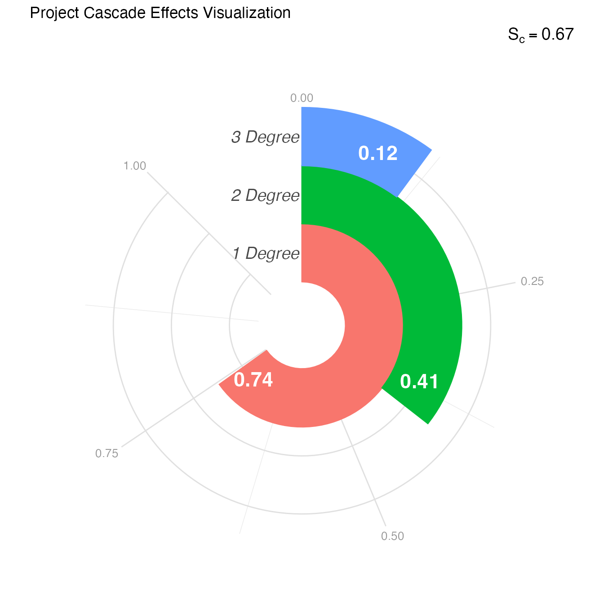

# Interpreting Cascade Effects Scores

``` r
library(centrimpact)
```

## What Are Cascade Effects?

The Cascade Effects Score (Sc) measures the **potential** for
information and power to spread through your project’s social network
across three degrees of separation. It’s based on a fundamental insight
from community-engaged research: direct participants aren’t the whole
story.

When you train community health workers (1st degree), they teach their
neighbors (2nd degree), who influence their extended networks (3rd
degree). When you work with parent leaders, their impact ripples through
schools, neighborhoods, and social groups. Cascade Effects quantifies
this ripple.

Unlike traditional evaluation that counts only direct participants,
cascade analysis recognizes that community work creates waves of
influence. A project reaching 50 people directly but catalyzing three
degrees of cascade achieves fundamentally different impact than one
reaching 200 with no ripple effect.

## Why Three Degrees?

While the famous “six degrees of separation” theory suggests global
interconnectedness, research shows that **direct personal influence
extends to about three degrees** (Christakis & Fowler, 2009). Beyond
three degrees, information becomes diluted and influence weakens
substantially.

The three degrees in community-engaged research:

- **1st Degree**: Core participants directly involved (faculty, staff,
  students, primary community partners)
- **2nd Degree**: Immediate networks of core participants—people they’re
  likely to share project experiences with meaningfully
- **3rd Degree**: Individuals within broader community that 2nd degree
  participants are likely to influence through shared knowledge or
  experiences

## How Cascade Differs from Ripple Mapping

If you’re familiar with ripple effects mapping (Chazdon et al., 2017),
Cascade Effects takes a related but distinct approach:

| Ripple Mapping                       | Cascade Effects                   |
|--------------------------------------|-----------------------------------|
| Qualitative visualization            | Quantitative network analysis     |
| Documents actual spread              | Models potential spread           |
| Created through facilitated dialogue | Calculated from network structure |
| Shows what happened                  | Predicts what could happen        |

Both are valuable—ripple mapping captures lived experiences of impact,
while cascade analysis reveals structural capacity for information/power
distribution.

## The Four Network Properties

Cascade Effects examines four properties that together reveal how well
information and power can spread:

### 1. Bridging (Connecting Separate Groups)

**What it measures**: People who connect different groups that wouldn’t
otherwise interact much

**Social network metrics**: Structural holes (constraint) + Degree
centrality on the inter-layer graph

**Why it matters**: Without bridge builders, information stays siloed
within specific communities or sectors. Bridges enable knowledge to
travel between different neighborhoods, organizations, demographic
groups, or social circles.

**High bridging looks like**: - A community health worker who
participates in both the Latinx parent group and the neighborhood
association - A researcher who sits on university and community
foundation boards - A youth leader active in both their high school and
the mosque

**Low bridging looks like**: - Core team members all come from the same
organization - Participant networks don’t overlap with each other -
Information doesn’t cross demographic or geographic boundaries

### 2. Channeling (Controlling Information Flow)

**What it measures**: People who serve as key gateways or bottlenecks
for information

**Social network metrics**: PageRank (local flow) + Harmonic centrality
(global transmission) on the inter-layer graph

**Why it matters**: Channelers control whether and how quickly
information spreads. They can either accelerate sharing or become
bottlenecks that restrict flow. In healthy networks, channeling is
distributed; in problematic ones, it’s concentrated.

**High channeling looks like**: - Multiple pathways for information to
flow - Distributed communication responsibility - Information reaches
people through various routes

**Low channeling looks like**: - Single person acts as information
gatekeeper - If one or two people stop participating, information flow
collapses - Communication bottlenecks slow knowledge sharing

### 3. Knitting (Strengthening Social Fabric)

**What it measures**: People who connect influential individuals within
communities, creating cohesive networks

**Social network metrics**: Community centrality + Eigenvector
centrality

**Why it matters**: Knitters create resilient social structures by
linking leaders, elders, and influential community members. When
influential people are connected to each other, communities can sustain
themselves and spread information even without external facilitation.

**High knitting looks like**: - Community elders who know and work with
each other - Organizational leaders who collaborate regularly -
Influential members who form collective leadership structures

**Low knitting looks like**: - Influential people isolated from each
other - Leaders who don’t know what other leaders are doing - Fragmented
leadership unable to coordinate collective action

### 4. Reaching (Accessing Network-Wide Information)

**What it measures**: People who balance trusted close relationships
with diverse distant connections for broad information access

**Social network metrics**: Local transitivity + Harmonic centrality

**Why it matters**: Good reachers can both receive information from
distant parts of the network and diffuse information widely. They
connect tight-knit groups (trusted relationships) with distant network
regions (diverse information).

**High reaching looks like**: - People with close friends who also know
each other (trust) - Same people also connected to distant network
regions (diversity) - Ability to access and share information across the
entire network

**Low reaching looks like**: - Isolated clusters with no cross-cluster
connections - People only connected to immediate neighbors - Limited
ability to access or spread information broadly

## Understanding the Overall Cascade Score

### How It’s Calculated

The overall Cascade Effects Score (Sc) uses the complement of the Gini
coefficient applied to the degree scores. The Gini coefficient measures
inequality; its complement measures balance.

Scores closer to 1 indicate information and power can spread more evenly
across all three degrees. Lower scores indicate concentration in the 1st
degree with poor distribution outward.

### Interpretation Guidelines

| Sc Range | Interpretation | What This Means |
|----|----|----|
| \< 0.50 | Very Low Balance | Impact highly concentrated in core; minimal cascade |
| 0.50 - 0.59 | Low Balance | Some spread to 2°, but significant drop-off by 3° |
| 0.60 - 0.69 | Moderate Balance | Reasonable distribution with gaps to address |
| 0.70 - 0.79 | High Balance | Strong potential for widespread distribution |
| ≥ 0.80 | Very High Balance | Excellent capacity for information/power spread |

## Example: Interpreting Your Cascade Score

Let’s work through the example from the Getting Started vignette:

``` r
# Generate example cascade data
cascade_data <- generate_cascade_data(seed = 36)

# Analyze cascade effects
cascade_results <- analyze_cascade(cascade_data)
#> Running full exact analysis (~356 expected edges).

# View overall score
print(cascade_results$cascade_score)
#> [1] 0.6689556
```

### What Sc = 0.65 Tells Us

A Cascade Effects Score of 0.65 indicates **moderate
balance**—information and power can spread reasonably well to the 2nd
degree but face barriers reaching the 3rd degree. This is common but
improvable.

Now let’s examine where the barriers lie:

``` r
# View degree-level summary
print(cascade_results$summary)
#> # A tibble: 3 × 9
#>   layer count gamma layer_knitting layer_bridging layer_channeling
#>   <int> <int> <dbl>          <dbl>          <dbl>            <dbl>
#> 1     1    10  0.9           0.462         0.866             0.768
#> 2     2    40  0.5           0.311         0.671             0.525
#> 3     3    80  0.45          0.304         0.0214            0.117
#> # ℹ 3 more variables: layer_reaching <dbl>, layer_score <dbl>,
#> #   layer_number <chr>
```

## Interpreting Degree-Level Scores

### 1st Degree (Core Participants)

    1° score: 0.69 (10 people)
    Bridging: 0.70 | Channeling: 0.68 | Knitting: 0.70 | Reaching: 0.69

**Interpretation**: Your core team has **excellent connectivity**. All
four properties score in the 0.68-0.70 range, indicating: - Core
participants connect different groups well (bridging) - Information
flows efficiently among them (channeling) - Influential members are
well-connected to each other (knitting)  
- Team can access and spread information broadly (reaching)

**What this means**: You have a strong foundation. Core team
relationships are healthy, communication works well, and leadership is
cohesive. This is the bedrock for cascade—but it’s not sufficient alone.

### 2nd Degree (Immediate Networks)

    2° score: 0.60 (29 people)
    Bridging: 0.57 | Channeling: 0.57 | Knitting: 0.63 | Reaching: 0.61

**Interpretation**: The 2nd degree shows **moderate capacity** with
specific weaknesses:

- **Bridging (0.57)**: Friends and family of core participants aren’t
  effectively connecting different community subgroups. They may be
  talking within their own circles but not across them.

- **Channeling (0.57)**: Information pathways to 2nd degree are somewhat
  restricted. Core participants may not be strategically sharing in ways
  that empower 2nd degree to pass information along.

- **Knitting (0.63)**: Relatively better—influential people in 2nd
  degree have some connections to each other, though not as strong as in
  the core.

- **Reaching (0.61)**: Reasonable ability to access information, but
  could be stronger.

**What this means**: Your project’s impact reaches the immediate circles
of core participants, but these connections aren’t strong enough to
serve as effective bridges to broader communities. The 2nd degree needs
more intentional engagement.

### 3rd Degree (Broader Community)

    3° score: 0.31 (45 people)
    Bridging: 0.32 | Channeling: 0.33 | Knitting: 0.29 | Reaching: 0.30

**Interpretation**: The 3rd degree shows **weak capacity** across all
properties:

- **Bridging (0.32)**: Limited connections between different groups at
  this distance from the core

- **Channeling (0.33)**: Few effective pathways for information to flow
  this far out

- **Knitting (0.29)**: The weakest property—influential people in the
  broader community aren’t connected to each other, creating fragmented
  rather than cohesive networks

- **Reaching (0.30)**: Minimal ability for these community members to
  access or diffuse information

**What this means**: Your project’s structural capacity for impact
largely stops at the 2nd degree. The broader community remains largely
disconnected, and influential leaders in that space aren’t forming the
collaborative networks needed to sustain and spread your work.

## Visualizing Cascade Effects

``` r
# Create racetrack visualization
plot_cascade <- visualize_cascade(cascade_results)
print(plot_cascade)
```



### Reading the Racetrack Plot

This radial visualization (inspired by W.E.B. DuBois’ pioneering data
visualizations) shows:

- **Rings**: Each represents a degree (1°, 2°, 3° from center outward)
- **Spokes**: Four spokes per ring represent the four properties
- **Spoke length**: Longer = higher score for that property at that
  degree

**Visual patterns to notice**:

- **Shrinking pattern**: Spokes get shorter moving outward (typical
  cascade decay)
- **Uniform shrinkage**: All properties decline together (systemic
  limitation)
- **Specific short spokes**: Individual properties notably weaker
  (targeted intervention opportunity)
- **Abrupt drops**: Sharp decline between degrees (structural barriers)

In our example, you can see: - Strong, relatively equal spokes at 1°
(solid core) - Moderate, slightly uneven spokes at 2°
(bridging/channeling slightly weaker) - Short, very weak spokes at 3°
(especially knitting)

## What Different Cascade Patterns Mean

### Pattern 1: Strong Core, Weak Periphery

    Example: 1° = 0.70, 2° = 0.50, 3° = 0.30

**Interpretation**: Project team well-connected internally but impact
doesn’t cascade outward. Common in early-stage projects or insular
research teams.

**Why it happens**: - Team focused on building internal capacity first -
Limited intentional engagement of extended networks - Core participants
not yet serving as community ambassadors - Project communications don’t
reach beyond immediate circle

**Actions to improve**: 1. Identify “ambassador” roles for 2°
participants 2. Create opportunities for 2° to engage directly (not just
hear about it) 3. Develop communication strategies that travel through
social networks 4. Support core participants in intentionally engaging
their networks

### Pattern 2: Bridging Deficit

    Example: Bridging consistently 0.15-0.20 lower than other properties

**Interpretation**: Information stays within silos rather than crossing
between different community groups, organizations, or demographics.

**Why it happens**: - Team members all from similar
backgrounds/sectors - No intentional cross-sector or cross-demographic
engagement - Separate initiatives for different groups rather than
integrated approach - Geographic or social boundaries limiting
connection

**Actions to improve**: 1. Map community subgroups and their boundaries
2. Recruit “bridge builders” who span multiple communities 3. Design
activities requiring cross-group collaboration 4. Create roles
specifically focused on connecting different sectors 5. Ensure
materials/events accessible across language and cultural barriers

### Pattern 3: Knitting Collapse at 3°

    Example: Knitting drops dramatically at 3° while other properties decline gradually

**Interpretation**: Influential people in broader community aren’t
connected to each other, limiting sustainable impact even if information
reaches them.

**Why it happens**: - Haven’t engaged community leadership structures -
Leaders operating in isolation without collaboration infrastructure -
Focus on grassroots without attention to influencer networks -
Competitive rather than collaborative environment among leaders

**Actions to improve**: 1. Identify community influencers (elders,
organizational leaders, cultural figures) 2. Create forums for these
leaders to connect with each other 3. Form steering committees or
advisory groups 4. Support collaborative initiatives among community
organizations 5. Facilitate peer learning among influential community
members

### Pattern 4: Channeling Bottlenecks

    Example: Channeling notably lower than other properties, especially at 2°

**Interpretation**: Information flow restricted by bottlenecks—too few
pathways or overly centralized communication.

**Why it happens**: - Single person (often PI) serving as information
hub - No distributed communication strategy - Partners don’t have agency
to share information independently - Gatekeeping (intentional or
structural) limiting spread

**Actions to improve**: 1. Distribute communication responsibilities 2.
Provide communication materials partners can share 3. Create multiple
channels for information flow 4. Empower partners to speak about the
work independently 5. Develop peer-to-peer communication strategies

### Pattern 5: Uniform Decline

    Example: All properties declining equally across degrees

**Interpretation**: Natural cascade decay without specific structural
barriers—simply distance from core reduces capacity.

**Why it happens**: - Limited project resources reaching extended
networks - Passive rather than active cascade strategies - Reliance on
organic spread without intentional support - Network structure naturally
favors local over distant connections

**Actions to improve**: 1. Invest resources in reaching extended
networks 2. Create incentives for 2° and 3° participation 3. Develop
“train the trainer” models 4. Support 2° participants in becoming
champions 5. Host “network weaving” events connecting multiple degrees

## Network Size and Composition

The number of people at each degree provides important context:

``` r
# View people at each degree
cascade_results$summary[, c("layer", "count")]
#> # A tibble: 3 × 2
#>   layer count
#>   <int> <int>
#> 1     1    10
#> 2     2    40
#> 3     3    80
```

### Interpreting Network Size

**Growing network (1° \< 2° \< 3°)**: - Natural expansion pattern - Each
person connects to multiple others - Indicates good potential reach if
quality connections develop

**Shrinking network (1° \> 2° \> 3°)**: - May indicate isolation of core
team - Limited connections to broader community - Suggests need to
expand engagement

**Stable network (similar sizes)**: - May indicate tight boundaries -
Each degree not expanding reach - Could signal insular community or
restricted engagement

In our example (10, 29, 45), we see healthy growth, but the low 3°
scores indicate these are weak connections rather than robust
relationships.

## The Topology Score

``` r
# View topology score
print(cascade_results$topology_score)
#> [1] 0.2310191
```

The topology score (0.18 in this example) reflects the overall network
structure:

**Components**: - **Connectedness**: How well all nodes connect to each
other - **Efficiency**: Speed of information transmission possible -
**Hierarchy** (inverse): Flatness of power structure - **Lubness**
(inverse): Distribution of leadership

### Interpreting Topology Scores

| Score | Interpretation |
|----|----|
| \< 0.30 | Hierarchical structure, potential bottlenecks, some disconnection |
| 0.30 - 0.50 | Moderate structure with some flat elements |
| 0.50 - 0.70 | Reasonably flat structure with distributed power |
| \> 0.70 | Highly distributed, well-connected, efficient network |

A low topology score (\< 0.30) reinforces that structural barriers
exist. In our example, the 0.18 suggests hierarchy, efficiency
bottlenecks, or disconnected segments limit cascade potential.

## Using Cascade Scores by Project Stage

### Early Stage (Year 1)

**Expected patterns**: - Strong 1° (building core team) - Moderate 2°
(engaging immediate networks) - Weak 3° (not yet reached broader
community)

**Focus**: Building a strong, well-connected core before worrying about
extended reach

**Red flags**: Weak 1° scores suggest internal team needs attention
first

### Mid-Stage (Years 2-3)

**Expected patterns**: - Sustained strong 1° - Growing 2° scores
(extended engagement taking hold) - Improving 3° (strategies starting to
work)

**Focus**: Strengthening 2° connections and developing 3° strategies

**Red flags**: Declining 1° suggests core team deterioration; stagnant
2° indicates lack of cascade strategy

### Late Stage (Year 3+)

**Expected patterns**: - Strong scores across all degrees - Balanced
properties (no dramatic gaps) - Growing network size

**Focus**: Sustaining cascade, documenting spread, preparing for
transition

**Red flags**: Weak 3° at this stage suggests impact won’t outlast
project; topology score not improving indicates structural issues remain

## Taking Action Based on Cascade Scores

### Step 1: Identify Your Cascade Pattern

Look at your overall score, degree progression, and property weaknesses
to determine which pattern(s) apply.

### Step 2: Target Specific Weaknesses

| Issue | Targeted Actions |
|----|----|
| **Low 1°** | Focus internally: team-building, communication protocols, role clarity |
| **Weak 2°** | Ambassador programs, direct engagement opportunities, communication tools |
| **Collapsed 3°** | Community influencer engagement, network weaving events, collaborative structures |
| **Bridge deficit** | Cross-sector recruitment, boundary-spanning roles, integrated programming |
| **Channel bottlenecks** | Distributed communication, peer sharing, multiple pathways |
| **Knit fragmentation** | Leadership connections, steering committees, collaborative forums |
| **Reach limitations** | Train-the-trainer models, peer champions, accessible materials |

### Step 3: Implement Network-Building Strategies

**For improving 2° cascade**: - Create “Champions Program” where 1°
actively engage their 2° networks - Host “bring a friend” events
lowering barriers to 2° participation  
- Develop shareable materials 2° can use independently - Establish 2°
feedback mechanisms so they contribute ideas

**For strengthening 3° connections**: - Map community influencers and
invite them into advisory roles - Create forums connecting different
community organizations - Support peer learning networks among community
leaders - Invest in relationship-building events at 3° level - Partner
with existing community structures rather than creating new ones

**For addressing property-specific issues**: - **Bridging**:
Intentionally recruit across boundaries, design cross-group activities -
**Channeling**: Distribute communication roles, create multiple
pathways - **Knitting**: Facilitate connections among leaders, support
collaborative initiatives - **Reaching**: Develop hub-and-spoke models,
support local champions

### Step 4: Monitor Change Over Time

Run cascade analysis at regular intervals: - Quarterly during active
network-building phases - Annually for longer-term projects - At major
project milestones

Track: - Overall Sc trajectory - Degree score changes - Property
improvements - Network size evolution - Topology score trends

### Step 5: Document and Share

When cascade improves: - Document what strategies worked - Share
network-building approaches with other projects - Use visualizations in
reports and presentations - Tell stories that bring the numbers to life

## Common Cascade Misinterpretations

**Mistake 1: “Bigger networks are always better”**

Not necessarily. A network of 100 poorly connected people has less
cascade potential than 30 well-connected people. Quality of connections
matters more than quantity.

**Mistake 2: “Low cascade scores mean project failure”**

Low scores in early stages are expected. Cascade develops over time as
relationships deepen and strategies take effect.

**Mistake 3: “We should focus only on expanding to 3°”**

Weak 3° often indicates weak 2°. Strengthen the 2° first—trying to
leapfrog rarely works.

**Mistake 4: “Perfect balance across degrees is the goal”**

Some natural decline is expected—influence diminishes with distance.
Moderate balance (Sc 0.60-0.75) with strong absolute scores is
excellent.

**Mistake 5: “Cascade scores measure actual impact”**

Cascade scores measure **potential** based on network structure. They
predict capacity for spread, not guarantee it. Actual impact requires
both structural capacity and quality content/relationships to spread.

## Communicating About Cascade Effects

### With Community Partners

**Frame positively**: “Our core team is really well-connected. Now let’s
think about how we can help spread this work to more people in the
community.”

**Use the visual**: The racetrack plot makes patterns immediately clear
even for those unfamiliar with network analysis.

**Co-interpret**: Ask partners what they see in the patterns and what
they think would help strengthen connections.

**Focus on action**: “What would help you share this work with people
you know?”

### With Funders

**Emphasize innovation**: Traditional evaluation counts direct
participants; cascade demonstrates reach multiplication effect.

**Show trajectory**: If scores improve over time, demonstrate
network-building success.

**Connect to sustainability**: Strong 3° cascade indicates work will
continue beyond funding period.

**Translate properties**: Explain bridging/knitting/etc. in accessible
language related to funder priorities.

### For Promotion/Tenure

**Contextualize reach**: “While we directly engaged 30 community
members, our cascade analysis shows potential reach to 85 people across
three degrees.”

**Document intentionality**: Describe specific strategies used to
strengthen cascade.

**Show sophistication**: Cascade analysis demonstrates advanced
understanding of community impact.

**Connect to transformation**: Strong cascade indicates mutual
transformation extending beyond core participants.

## Conclusion

Cascade Effects scores reveal the structural capacity for your
community-engaged work to spread and sustain itself. Key takeaways:

1.  **Strong core is necessary but insufficient**—impact must cascade
    outward
2.  **Property-specific weaknesses indicate targeted action
    opportunities**
3.  **Natural decline is expected**; the question is whether it’s
    gradual or precipitous
4.  **Network structure matters as much as network size**
5.  **Cascade develops over time**—early-stage weakness isn’t failure
6.  **Intentional network-building strategies can improve cascade
    significantly**

When used alongside other CEnTR\*IMPACT metrics and qualitative
assessment, cascade analysis helps you understand not just who you’ve
reached, but how far your work can spread—and what barriers need
addressing to extend that reach into the broader community.

## References

Chazdon, S., Emery, M., Hansen, D., Higgins, L., & Sero, R. (2017). *A
Field Guide to Ripple Effects Mapping*. University of Minnesota
Libraries Publishing.

Christakis, N. A., & Fowler, J. H. (2009). *Connected: The Surprising
Power of Our Social Networks and How They Shape Our Lives*. Little,
Brown and Company.

Price, J. F. (2024). *CEnTR*IMPACT: Community Engaged and Transformative
Research – Inclusive Measurement of Projects & Community
Transformation\* (CUMU-Collaboratory Fellowship Report). Coalition of
Urban and Metropolitan Universities.
